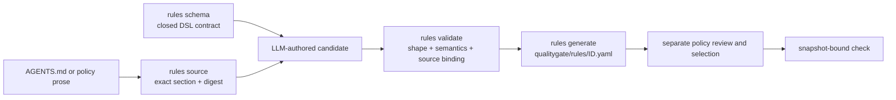

# Schema-guided repository rules

[简体中文](../../zh/01-user-guide/06-schema-guided-repository-rules.md) · [Volume index](README.md) · [Rule reference](../02-reference/02-rules.md)

Two ideas define project-rule authoring in Qualitygate:

1. An executable rule is structured, versioned data governed by a closed JSON
   Schema. It is not an informal prompt or arbitrary plugin code.
2. Repository instructions such as `AGENTS.md` are source material. An LLM can
   translate their enforceable clauses into rule candidates, but the matching
   CLI binds the exact source, validates the Schema and semantics, publishes the
   candidate, and later evaluates it against a snapshot.

This division keeps natural-language intent reviewable without making model
interpretation part of the gate.



## What the Schema structures

The version-matched project-rule Schema is available from `rules schema` and in
the Agent Skill at `references/schemas/project-rule.schema.json`.

| Contract field | Meaning |
| --- | --- |
| `schema_version`, `id`, `version` | Protocol and stable rule identity. |
| `source` | Repository-relative document, exact section, and digest returned by `rules source`. |
| `language`, `applies_to` | Explicit language and path/provenance scope. |
| `requires_capabilities` | Facts the evaluator must possess; absence becomes incomplete. |
| `when` | A closed subject/change selector for commits, files, tests, comments, or imports. |
| `then` | Supported name, text, marker, dependency, count, required-path, line, or word assertions. |
| `binding` | Typed annotation, comment, or Git-trailer association when traceability is required. |
| `fix` | Actionable remediation derived from the same source clause. |

Unknown fields are rejected. JSON Schema checks the serial form; the CLI also
checks regexes, globs, conditional field combinations, confined paths, source
bytes, capability compatibility, duplicate IDs, and resource budgets. Passing
either layer does not approve the rule or prove that prose was translated
correctly.

## Convert `AGENTS.md` without inventing policy

First export the runtime contract and bind the exact normative section:

```bash
qualitygate --root . rules schema --format json
qualitygate --root . \
  rules source --document AGENTS.md --section "Quality contract" --format json
```

Copy the returned `source` object verbatim into a candidate. For example, the
line-limit clause has this shape; replace the abbreviated hash with the exact
value returned by `rules source`:

```yaml
schema_version: 1
id: authored-file-line-limit
version: 1
source:
  document: AGENTS.md
  section: Quality contract
  content_hash: "sha256:<exact digest returned by rules source>"
language: []
required: true
severity: error
applies_to:
  paths: ["src/**/*.rs", "tests/**/*.rs", "docs/**/*.md", "*.md", ".github/workflows/*"]
requires_capabilities: [files]
when:
  entity: file
  change: all
then:
  max_lines: 1000
fix: Split the authored file without weakening its ownership or test contract.
```

Then classify each remaining clause by the evidence it actually needs:

| Example repository constraint | Correct representation |
| --- | --- |
| “Authored source, tests, docs and workflows stay within 1,000 lines.” | Project rule: `file`, `change: all`, scoped paths, `max_lines: 1000`. |
| “These owner or test files must exist.” | Project rule: complete file inventory plus `required_paths`. |
| “Imports from layer A to layer B are forbidden.” | Parsed `import` rule only when source imports are sufficient; otherwise `module-boundary` with project facts. |
| “Dependencies must remain acyclic.” | Existing architecture lint or bounded command check; a text regex cannot prove the graph property. |
| “Run fmt, clippy and all tests.” | Policy command checks, not a project-rule assertion. |
| “A reviewer must judge design quality.” | Human/manual acceptance; do not turn judgment into a guessed regex. |

Only clauses expressible by the finite DSL become project-rule candidates.
Unsupported clauses remain visible as capability gaps or are routed to an
existing lint, AST/project adapter, command check, or manual decision.

After writing a candidate in an authorized scratch path, validate and publish
it through the matching CLI:

```bash
qualitygate --root . rules validate candidate.yaml --format json
qualitygate --root . rules generate --input candidate.yaml --format json
qualitygate --root . rules validate --format json
```

`generate` writes `qualitygate/rules/<id>.yaml` atomically and does not enable
the rule. Adoption is a separate policy change: select the project-rule
directory, enable the ID in the intended profile, preserve source review, and
run a new snapshot check. A new source digest, successful generation, or an LLM
recommendation is never approval.

## Skill over CLI

For an Agent, the Qualitygate Skill is the decision and safety layer over the
CLI. It tells the LLM which workflow and evidence strength to use, when mutation
needs authorization, and when an obligation is not representable. The CLI is
the executable authority for Schema export, exact source binding, validation,
generation, policy planning, and checking. The LLM must not emulate those
operations, hand-author an unvalidated “equivalent” format, or treat prose
interpretation as a passing gate.

See the packaged [rule-authoring workflow](../../../skills/qualitygate-cli/references/rule-authoring.md)
for the complete Agent procedure and the
[rule-engine architecture](../03-architecture/06-rule-engine-implementation.md)
for runtime implementation boundaries.
