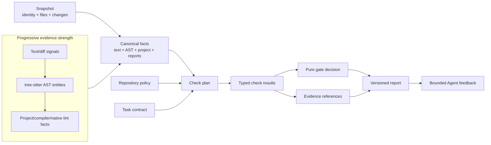

# Logical view

[简体中文](../../zh/03-architecture/01-logical-view.md) · [Volume index](README.md)

The logical view describes the stable concepts exposed by the reusable core:
snapshots, facts, policies, checks, diagnostics, evidence, tasks, and gate
decisions. It answers “what capabilities exist and how do they relate?” without
depending on a CLI process or deployment topology.



Policy and task are separate inputs to one plan. Adapters publish facts but do
not decide the gate. The domain combines typed results without filesystem,
process, or network access. A missing stronger fact never degrades silently to
a weaker one.

The core engine is language-neutral. Adapters publish explicit facts with
capability and completeness metadata; policy rules consume those facts; the
application combines their outcomes with command evidence and task acceptance.

```text
Git snapshot
  -> language, project, and report adapters
  -> canonical facts plus capability gaps
  -> validated repository policy and optional task contract
  -> dependency-aware execution plan
  -> bounded rule and command evidence
  -> complete/pass decision, report, and optional feedback
```

Language adapters detect supported files and extract structures such as tests,
annotations, imports, calls, and comments. Project adapters resolve module,
dependency, interpreter, and build facts. Report adapters normalize existing
tools without claiming semantics their source format does not provide. Syntax
trees do not imply type resolution or data-flow knowledge.

Configuration loading is strict and snapshot-bound. Planning records why every
check applies, what it depends on, whether it is required, and what completion
evidence is expected. Task checks are merged without removing repository checks.
The application schedules only when prerequisites permit and retains skipped or
pending checks explicitly.

Evidence is typed: source locations, fingerprints, command attempts, raw report
digests, tool versions, coverage totals, acceptance records, and provenance have
different contracts. Adapters never turn an absent value into a default fact.
The pure domain computes gate decisions from those typed inputs; it does not read
the filesystem or invoke tools.

Feedback is a bounded projection, not a second decision engine. Rechecks return
to the same acquisition, planning, execution, and decision flow. This prevents
an Agent-facing summary from drifting away from the full report.

The rule engine is one consumer of this model, not the whole architecture. It
supports cheap diff/text signals, tree-sitter structural rules, project-fact
rules, custom DSL rules, and native lint/report adapters while preserving their
different evidence strengths. See the
[rule-engine deep dive](06-rule-engine-implementation.md).
