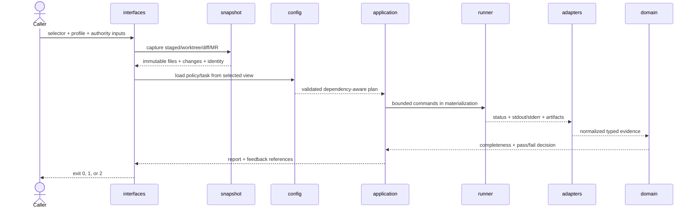

# Process view

[简体中文](../../zh/03-architecture/02-process-view.md) · [Volume index](README.md)

The process view explains runtime ordering, asynchronous ownership, concurrency,
deadlines, cancellation, and failure propagation for one check and its rechecks.

A check never treats mutable repository paths as execution truth. The snapshot
layer resolves the selector, inventories entries, applies byte/file/time bounds,
hashes acquired content, and produces an immutable input. Policy, task, custom
rules, source files, and build inputs are loaded from that selected view unless
the caller supplies an explicit external authority input.

The immutable handoff is the key boundary. Later stages receive captured bytes
and digests, not permission to reopen the developer's mutable source paths.
External trust records are revalidated as protected caller inputs and are never
silently taken from the checked tree.

Materialization creates a disposable directory for project commands. A command
receives fixed argv, cwd, environment policy, deadline, output limits, and
expected artifacts. The runner drains stdout and stderr without unbounded
buffers, terminates timed-out process trees, and preserves partial evidence.
Blocking operations do not hold asynchronous orchestration resources.

Snapshot identity and policy/task digests flow into every plan and report.
Before a result is accepted, the application confirms that produced evidence
belongs to the same materialized snapshot. Mutation, missing objects, invalid
paths, or report identity mismatch invalidate affected checks.

Concurrency is bounded at acquisition, parsing, rule evaluation, and command
execution. Deadlines and counters are shared where work contributes to one
contract; splitting work cannot bypass a global cap. Deterministic ordering is
restored before serialization so parallel execution does not create unstable
reports.

Network activity belongs to the remote adapter path and is never an implicit
fallback for local evidence. Credentials are caller inputs and are not copied
into reports. The CLI does not modify user Git configuration or the selected
source repository while materializing a check.

The final decision distinguishes a rule violation from an inability to finish.
Fail-closed handling is part of the architecture: an unavailable tool, timeout,
oversized report, parse error, conflict, symlink escape, or unsupported file
shape cannot be converted to a successful empty result.

The same sequence is used for quick and full profiles. Profiles change the plan,
not the meaning of evidence. A quick result carries the checks it omitted; a
recheck captures a new snapshot instead of attaching old evidence to new bytes.
