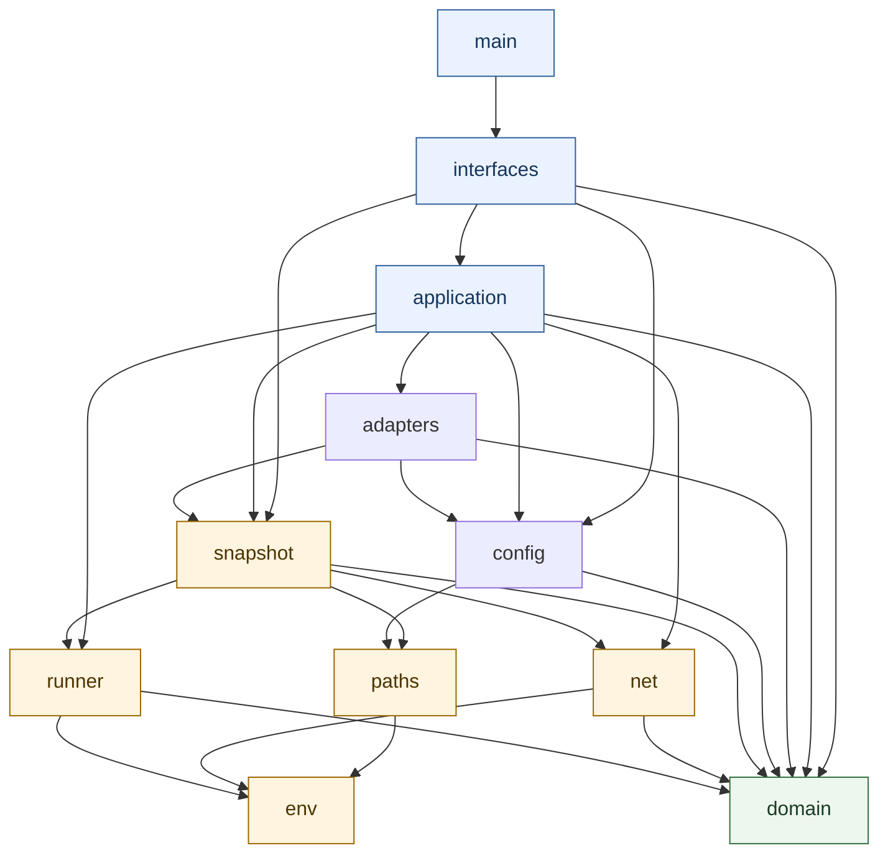

# Development view

[简体中文](../../zh/03-architecture/03-development-view.md) · [Volume index](README.md)

The development view maps logical responsibilities to Rust source owners,
allowed imports, test surfaces, and build-time enforcement. It answers “where
does a change belong, and what may it depend on?”

The Rust crate uses explicit top-level owners and an acyclic dependency graph.
The crate root declares owners only; the executable top level delegates to the
interface layer.

Arrows mean “may depend on.” All owners may use pure domain contracts; only the
named boundary owners may touch their corresponding external capability. The
graph is intentionally asymmetric: for example, adapters may consume snapshot
facts, but snapshots never import an adapter; interfaces call application use
cases, but application never parses CLI arguments.

| Owner | Responsibility |
| --- | --- |
| `domain` | Serializable contracts and pure gate decisions; no process, filesystem, network, or environment I/O. |
| `env` | Environment-variable reads and environment-derived values. |
| `paths` | Confined path validation and safe resolution. |
| `net` | Bounded network ownership and remote acquisition contracts. |
| `runner` | Bounded asynchronous process execution and captured evidence. |
| `snapshot` | Git selectors, immutable file acquisition, change mapping, and materialization. |
| `config` | Strict policy/task loading, validation, and planning. |
| `adapters` | Language/project facts and external report normalization. |
| `application` | Check orchestration, feedback, rechecks, and use-case coordination. |
| `interfaces` | CLI parsing and output rendering. |
| `main` | Process entry point delegating to `interfaces`. |

Shared contracts belong in `domain`, not in the CLI or a concrete adapter.
Interfaces do not perform external I/O directly. Blocking filesystem and parser
work stays isolated from asynchronous orchestration. Network, environment, and
path access have dedicated owners so capability review is explicit.

The architecture test parses every production Rust source, resolves module and
import paths (including grouped, aliased, macro, and conditional references),
checks owner edges and forbidden capabilities, detects cycles, and writes a
reviewable source-digest/line report plus DOT graph. It rejects hidden root
re-exports, ambiguous module files, unknown owners, broad external globs, and
I/O from pure domain code.

Documentation, examples, tests, and build metadata may exercise the public
surface but do not create another production owner. When module ownership or
imports change, run the architecture gate and inspect its reported edges rather
than accepting compilation alone.

This separation supports three independent review questions: whether a decision
is pure and serializable, whether an external action is confined and bounded,
and whether orchestration combines those capabilities without creating a cycle.
It also keeps the reusable library independent from the executable interface.
