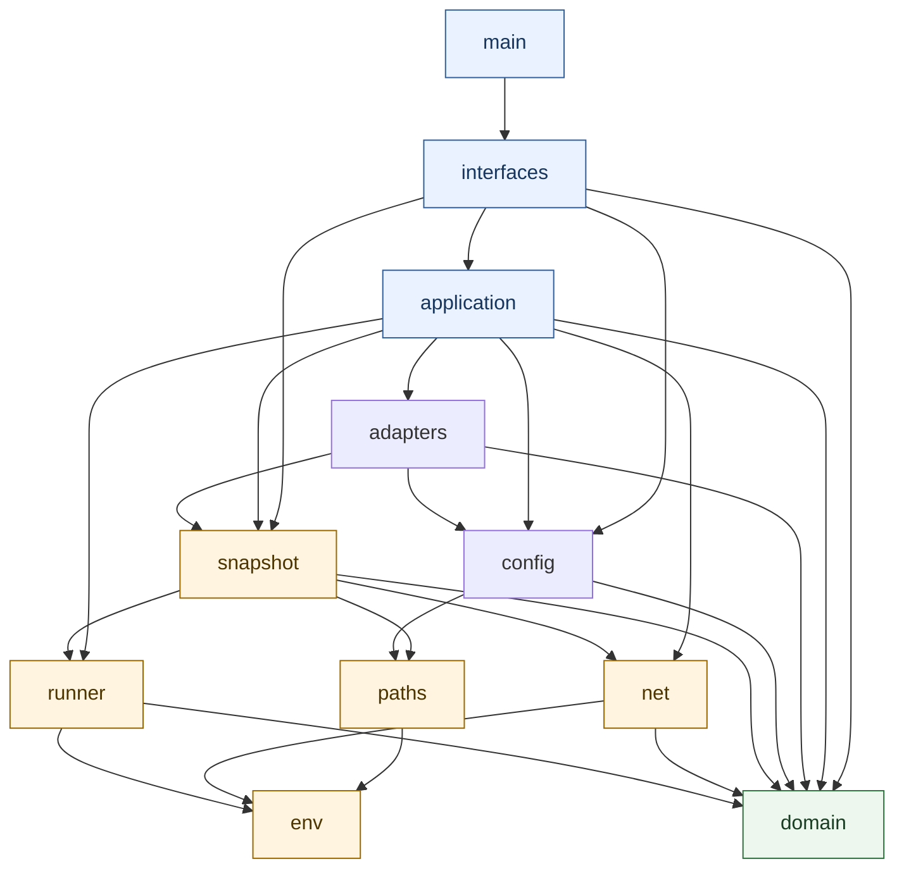

# Development view

[简体中文](../../zh/03-architecture/03-development-view.md) · [Volume index](README.md)

The development view maps logical responsibilities to Rust source owners,
allowed imports, test surfaces, and build-time enforcement. It answers “where
does a change belong, and what may it depend on?”

The Rust crate uses explicit top-level owners and an acyclic dependency graph.
The crate root declares owners only; the executable top level delegates to the
interface layer.

Business modules live directly under `src/qualitygate`. Cohesive groups use
directories with their implementation files at the root; a single-module owner
such as `content_digest` uses `content_digest.rs`. There are no nested
`application`, `config`, `domain`, `interfaces` or `adapters` wrapper directories.
The historical APIs remain in the flat compatibility files `application.rs`,
`config.rs`, `domain.rs`, `interfaces.rs` and `adapters.rs`. Each implementation
module has an explicit capability owner; a facade re-export does not grant a
different role access to I/O.

| Business module | Owned responsibility |
| --- | --- |
| `agent_runtime` | Projects agent obligations and runs the bounded agent host. |
| `policy_lifecycle` | Authenticates, activates, promotes, validates and rolls back policy versions. |
| `rule_catalog` | Discovers, authors, parameterizes and queries rule definitions and operators. |
| `constraint_coverage` | Binds declared constraint clauses to execution evidence and computes coverage. |
| `gate_execution` | Schedules planned checks and computes the final gate report. |
| `compatibility_verification` | Prepares compatibility inputs and evaluates producer/consumer compatibility. |
| `test_effectiveness` | Checks counterexample evidence by executing tests against current and prior code. |
| `snapshot_preflight` | Diagnoses snapshot acquisition, tool prerequisites and execution readiness. |
| `selfcheck` | Runs the bundled evaluator corpus and reports verified shapes and gaps. |
| `pilot_acceptance` | Validates pilot inventories, schedules, budgets and acceptance records. |
| `judgment_review` | Requests and validates external advisory judgments without granting acceptance. |
| `report_evidence` | Resolves captured report sources, normalizes gate evidence and renders reports. |
| `external_acceptance` | Authenticates external attestations, manual acceptance and provenance evidence. |
| `check_planning` | Loads bounded configuration and builds validated dependency-ordered check plans. |
| `resource_selection` | Selects changed resources and enforces exclusion and snapshot acquisition budgets. |
| `repair_feedback` | Builds actionable repair feedback and verifies replayed delivery identity. |
| `content_digest` | Provides pure canonical byte hashing and digest validation. |
| `xml_parsing` | Parses bounded XML documents and accounts for namespace work. |
| `cli_dispatch` | Parses root CLI commands and dispatches to domain-specific interfaces. |
| `rule_evaluation` | Evaluates builtin rules and versioned custom operators over captured facts. |
| `source_analysis` | Extracts syntax, language bindings and changed entities with bounded workers. |
| `maven_analysis` | Resolves Maven project models, dependency declarations and usage. |
| `python_analysis` | Resolves Python projects, dependency markers and package metadata. |

The dependency graph below describes capability owners, independently of the
physical directory. The architecture gate maps each `feature::module` to its
reviewed owner, resolves legacy facade paths to the same owner and rejects
unregistered modules. Business roots only declare the concrete modules in
`tests/quality/architecture_owners.rs`; they cannot hide implementation or broad
re-exports. For example, `agent_runtime::host_decisions` is pure, while
`agent_runtime::host_controller` orchestrates execution. Bazel compiles these
owners separately through `bazel/owners/*.rs` and the `//src/qualitygate:<owner>`
targets, so pure contracts cannot gain orchestration dependencies accidentally.
Cargo and Bazel expose both the business paths and compatible historical APIs.
Architecture reports retain source digests and file/line evidence.

```mermaid
flowchart TD
    main --> interfaces
    interfaces --> application
    interfaces --> config
    interfaces --> snapshot
    application --> adapters
    application --> config
    application --> snapshot
    application --> runner
    application --> net
    adapters --> config
    adapters --> snapshot
    snapshot --> net
    snapshot --> paths
    snapshot --> runner
    config --> paths
    paths --> env
    net --> env
    runner --> env
    interfaces --> domain
    application --> domain
    adapters --> domain
    config --> domain
    snapshot --> domain
    net --> domain
    runner --> domain

    classDef pure fill:#eef7ee,stroke:#2f6f3e,color:#183d22
    classDef boundary fill:#fff4df,stroke:#9a6700,color:#4d3500
    classDef orchestration fill:#eaf2ff,stroke:#315f9b,color:#17365d
    class domain pure
    class env,paths,net,runner,snapshot boundary
    class application,interfaces,main orchestration
```

Arrows mean “may depend on.” All owners may use pure domain contracts; only the
named boundary owners may touch their corresponding external capability. The
graph is intentionally asymmetric: for example, adapters may consume snapshot
facts, but snapshots never import an adapter; interfaces call application use
cases, but application never parses CLI arguments.

| Owner | Responsibility |
| --- | --- |
| `domain` | Serializable contracts and pure gate decisions; no process, filesystem, network, or environment I/O. |
| `env` | Environment-variable reads and environment-derived values. |
| `paths` | Confined path validation and safe resolution. |
| `net` | Bounded network ownership and remote acquisition contracts. |
| `runner` | Bounded asynchronous process execution and captured evidence. |
| `snapshot` | Git selectors, immutable file acquisition, change mapping, and materialization. |
| `config` | Strict policy/task loading, validation, and planning. |
| `adapters` | Language/project facts and external report normalization. |
| `application` | Check orchestration, feedback, rechecks, and use-case coordination. |
| `interfaces` | CLI parsing and output rendering. |
| `main` | Process entry point delegating to `interfaces`. |

Shared contracts belong to pure modules in the relevant business owner. The
architecture table assigns these modules to the `domain` capability.
Interfaces do not perform external I/O directly. Blocking filesystem and parser
work stays isolated from asynchronous orchestration. Network, environment, and
path access have dedicated owners so capability review is explicit.

`check_planning::dependencies` builds identifier and adjacency indexes once for each
graph operation. Validation, profile prerequisite closure and command
applicability use iterative traversal. Topological order always selects the
earliest policy-declared eligible node; unknown, repeated, disabled or cyclic
dependencies remain errors. Deep reverse chains do not consume recursive stack
frames or repeatedly scan the complete graph.

`snapshot::ScopeIndex` borrows a snapshot for one operation and indexes old paths
once. Inventory, diagnostic, coverage and retained-marker loops reuse it instead
of scanning all changes for every path. Current keys take precedence, duplicate
old paths retain the first snapshot-ordered match, and repository/delivery plus
feedback scope semantics remain unchanged. The public mutable snapshot contains
no cached index; a later operation rebuilds from its current changes.

`check_planning::yaml_budget` owns the shared YAML expansion preflight. It visits values
without materializing their collections or copying alias strings, before the
existing duplicate-key and typed decoders. Configuration, tasks, rules and
validation suites share this boundary. Application policy-trust loading calls
the public, typed `policy_lifecycle::policy_acceptance::parse_trust` entry point inside its
existing blocking work. This boundary also works when Bazel compiles owners as
separate crates; the generic YAML decoder remains private to configuration.

`check_planning::yaml_scalar_work` runs first, using Saphyr parser events to account for
scalar text before numeric resolution. It caches completed anchor costs and
tracks open collections, rejects recursive aliases, and retains source locations.
It builds no YAML Value tree. The existing Serde decoder still owns value and
typed semantics, including duplicate-key rejection; its errors and the event
budget errors share the configuration diagnostic boundary.

`xml_parsing::xml_budget` owns pure namespace-work accounting shared by configuration
discovery and adapters. It consumes counts, bounds its scope stack and checks
arithmetic; XML tokenization, tree parsing and profile-specific errors remain in
the consuming owners.

`report_evidence::tool_reports::sarif_locations` owns reference-step, text-work and retained
location budgets. It borrows logical names while resolving tables and charges
locations before retention. `report_evidence::tool_reports::json_budget` meters compact JSON
through a counter with no filesystem access; normalized results use the same
meter before append, avoiding an allocation merely to measure serialized size.
The report adapters share its checked append operation for ordinary lint and
test diagnostics. Each report shares one budget across all files; the counter
does not alter producer validation, source mapping or execution ownership.

`report_evidence::report_sources` resolves diagnostic, affected-scope and coverage
paths against captured inputs. Exact paths use the snapshot map directly.
Suffix lookup builds a separate lazy index for current and baseline paths,
borrowing strings and ordering them by reversed bytes. Binary search finds the
first component-boundary match; a second match rejects ambiguity. Coverage and
diagnostic gates depend on this leaf instead of calling each other's helpers.
Source confinement, case sensitivity and baseline rename handling stay intact.
The same resolver lazily indexes baseline renames after original-source line
validation. It borrows old and current paths, ignores other change kinds and
reuses empty results. Duplicate old paths retain the first snapshot-ordered
target; rename chains are not followed recursively.

`xml_parsing::document` owns bounded XML tree parsing for reports,
Maven models and compatibility evidence. Callers enforce their byte budgets;
report-specific DOCTYPE normalization stays in `reports`. Iterative preflight also
limits attributes to 1,024 per element and 100,000 per document, including namespace
declarations, before the tree parser's duplicate-name comparisons. Project and compatibility
adapters depend on this shared leaf without importing report-format machinery.

Configuration discovery owns its advisory Maven manifest validation in
`check_planning::discovery::maven_manifest`. It bounds XML depth, nodes and attributes before deriving
command candidates, and reports unsupported manifests as discovery gaps. This
profile stays within `config`; it neither imports adapters nor produces resolved
project facts. Adapter report failures retain their separate execution semantics.

The architecture test parses every production Rust source, resolves module and
import paths (including grouped, aliased, macro, and conditional references),
checks owner edges and forbidden capabilities, detects cycles, and writes a
reviewable source-digest/line report plus DOT graph. It rejects hidden root
re-exports, ambiguous module files, unknown owners, broad external globs, and
I/O from pure domain code. Clap imports/derives belong to `interfaces`, not
`domain`. Reserved path-I/O method names (`canonicalize`, `try_exists`, `exists`,
`metadata`, `symlink_metadata`, `read_dir`, `read_link`, `is_file`, `is_dir`) are
rejected in domain/interfaces, including ordinary method calls, macro tokens and
explicit `std::path::Path`/`PathBuf` calls. This is a conservative syntactic
contract, not receiver type inference or proof of all possible I/O.

CLI root resolution delegates to `snapshot_preflight::repository_root`, which uses
`spawn_blocking` and the `paths` owner while preserving native canonicalization
and error context. `content_digest` owns canonical byte hashing and format
validation; callers retain serialization and streaming framing. Pure
`rule_catalog::rule_parameters` contracts serve configuration discovery and validation
as well as adapter pattern compilation. Literal diagnostic metadata belongs to
the builtin definition; the evaluator consumes it without rule-ID branches.
The [clean contract review](../../../knowledge/best-practices/engineering-standards/guides/clean-contracts.md)
explains these ownership decisions and their limits.

Documentation, examples, tests, and build metadata may exercise the public
surface but do not create another production owner. When module ownership or
imports change, run the architecture gate and inspect its reported edges rather
than accepting compilation alone.

This separation supports three independent review questions: whether a decision
is pure and serializable, whether an external action is confined and bounded,
and whether orchestration combines those capabilities without creating a cycle.
It also keeps the reusable library independent from the executable interface.

Source layout and naming are part of the reviewed architecture contract.
Use descriptive `snake_case` business, module and file names; avoid generic
`common` or `utils` owners. Leaf modules use `name.rs`; modules with children
use `name/mod.rs`. Their unit tests live in `name_tests.rs` or the directory's
`tests.rs`, with descriptive scenario names when a suite is split.
Protocol adapters name the actual format (`sarif.rs`, `cobertura.rs`), while
`xml_reports.rs` explicitly dispatches multiple XML report formats.
The historical adapter API is a flat compatibility facade; implementations and
tests live directly in their business owners. Same-name responsibilities receive
specific names, such as `rollback_contracts`, `rollback_store` and
`rollback_workflow`. Remove empty directories and role-only wrappers rather than
preserving a directory just for a forwarding `mod.rs`. Keep subdirectories for
cohesive implementations with their own child modules, such as `tool_reports`
and `syntax`. Shared facade tests live in `contract_tests`; relocated Bazel entries live
together in `bazel/owners`. Single-file infrastructure owners such as `env` and
`paths` also use flat `.rs` files. The architecture gate checks names,
rejects role wrappers and empty directories, and rejects adapter-to-CLI or
orchestration dependencies.

Miri selects the pure modules from a reviewed inventory in the workflow. The
architecture gate requires that inventory to match every pure module in the
ownership table. Each of the four Miri shards lists its selected tests, rejects
an empty selection, then runs the same selection; uploaded inventories make the
executed scope reviewable. Miri and ASan remain separate from stable checks.

---

[Previous: Process view](02-process-view.md) · [Contents](../README.md) · [Next: Physical view](04-physical-view.md)
