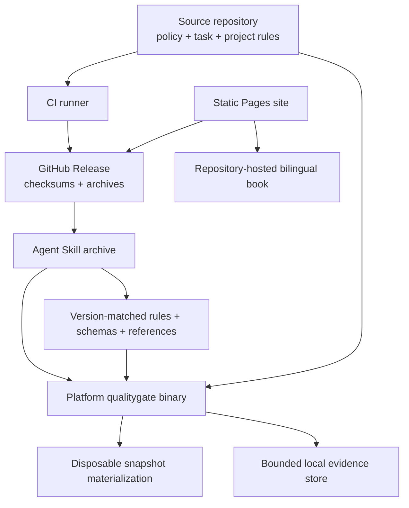

# Physical view

[简体中文](../../zh/03-architecture/04-physical-view.md) · [Volume index](README.md)

The physical view shows how versioned binaries, rule assets, the Agent Skill,
repository policy, CI runners, release archives, and the static site are placed
and connected.

The executable and rule assets form one compatibility unit. Repository policy
remains repository-owned; trust stores and signed evidence remain external to
the checked tree; transient materializations and evidence directories are not
deployment sources.

The distributable Agent Skill is a versioned wrapper around the released CLI,
not an alternative implementation. Its archive contains `SKILL.md`, provider
metadata, references, schemas, rule assets, fixtures, pilot templates, and
platform binaries. Package and CLI versions must match.

At runtime the Skill selects only the binary for the active operating system and
architecture, verifies `--version`, and points the CLI at the bundled rule asset
directory. An unavailable or incompatible asset may fall back to a verified
published installation. It must not build or trust the repository checkout
silently, cross a Windows/POSIX shell boundary, or omit missing assets.

Skill guidance preserves the CLI's authority boundaries. It can discover rules,
run checks, and project repair feedback. It cannot invent a trusted policy,
task acceptance, evidence directory, signature, manual approval, or reviewer
decision. A final code-task claim requires an unfiltered full check of the final
snapshot plus separately required repository gates.

Release automation validates Rust quality gates, package contents, exported
schemas, bundled rule bytes, pilot assets, version agreement, and archive
checksums before publishing. Platform builds and release artifacts are distinct
from source-tree tests. A tag may publish; a manual dry run does not silently
create a release.

The static Pages site is deployed from `site/` on `main`. It links to the
repository-hosted English and Chinese books rather than copying them into the
site artifact. Site tests check current-version download URLs and repository
document targets; an actual Pages deployment remains external evidence.
