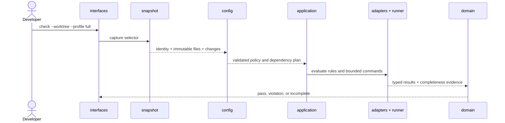
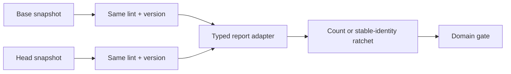
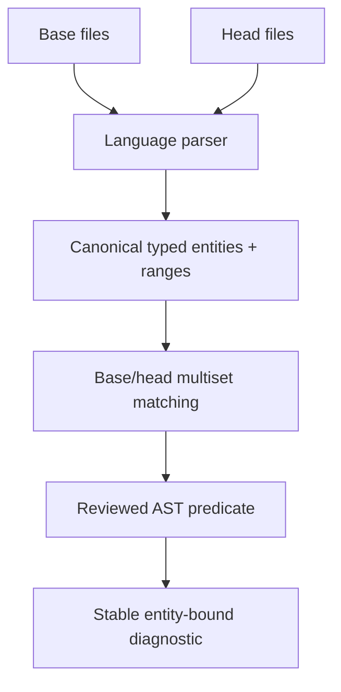
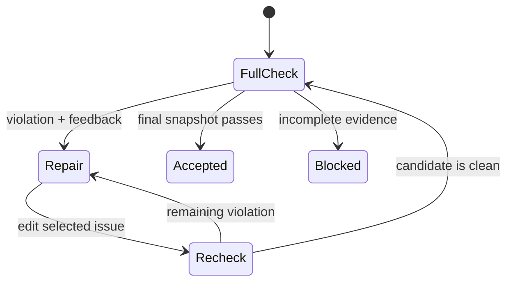

# +1 Scenarios

[简体中文](../../zh/03-architecture/05-scenarios.md) · [Volume index](README.md)

The +1 view validates the other four views with observable workflows. Each
scenario names its logical contracts, runtime path, source owners, physical
placement, and fail-closed outcome. These are architectural scenarios, not a
second set of CLI instructions.

## Scenario 1: snapshot-bound first check

- Logical: a snapshot, policy, plan, typed results, evidence, and gate decision.
- Process: capture precedes planning; all producers share the snapshot identity
  and resource bounds.
- Development: `interfaces` delegates, `application` orchestrates, adapters
  normalize, and `domain` alone decides.
- Physical: the released binary reads repository policy and writes bounded
  evidence beside a disposable materialization.
- Failure: missing files, policy errors, timeouts, and malformed reports return
  incomplete; a completed finding returns violation.

## Scenario 2: reuse a native lint with a ratchet

- Logical: native findings remain native facts; the ratchet is the policy
  assertion and does not rename the lint's semantics.
- Process: base and head use identical producer configuration under deadlines,
  output caps, and completion checks.
- Development: `runner` owns the process; a report adapter validates and
  normalizes; configuration plans the dependency; the domain compares evidence.
- Physical: the project supplies its existing lint and configuration while the
  CLI supplies orchestration and the report contract.
- Failure: a missing tool, changed version, partial report, or unbound snapshot
  is incomplete rather than a zero-finding baseline.

## Scenario 3: strengthen a rule with tree-sitter AST

- Logical: parser capabilities and canonical entities replace an ambiguous text
  signal while the public rule/report contract stays stable.
- Process: complete base/head changes are parsed within shared deadlines and
  entity caps before filters and predicates are applied.
- Development: language adapters own tree-sitter queries; shared entity and
  diagnostic contracts remain in the reusable core.
- Physical: grammar crates are third-party native dependencies linked into the
  released binary; no parser service is required.
- Failure: an unsupported language, parse failure, ambiguous copy, or exhausted
  budget is represented explicitly. AST precision is not presented as type or
  data-flow analysis.

## Scenario 4: bounded Agent repair loop

- Logical: feedback is a projection of the same report and stable fingerprints,
  never a separate authority.
- Process: every recheck captures current bytes; iteration and output are
  bounded, and final acceptance reruns the unfiltered full plan.
- Development: `application` owns feedback/recheck coordination while
  `interfaces` only renders it.
- Physical: the Agent Skill invokes the version-matched released binary and
  bundled assets; trust inputs remain external.
- Failure: stale fingerprints, snapshot drift, exhausted iterations, or
  incomplete evidence stop acceptance.

## Scenario 5: release and consume the Skill

Release automation runs quality gates, verifies schemas and bundled rule bytes,
builds platform archives, checks package/CLI version agreement, and publishes
checksums. A consumer selects the matching platform binary, verifies its
version, supplies repository-owned policy, and runs the same scenario 1 flow.
The physical package therefore cannot bypass the logical evidence model,
process bounds, or development ownership graph.

These scenarios are covered by unit and integration gates at their owning
boundaries. A change that alters one scenario must update its requirement and
test evidence in [CodeSpec](../../../codespec/requirements/qualitygate-cli.md).
