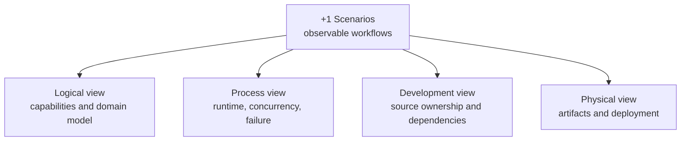

# Volume 3: Architecture — 4+1 views

[简体中文](../../zh/03-architecture/README.md) · [Book](../README.md)

The main architecture follows Kruchten's 4+1 model. Each view answers a
different review question; the scenarios connect them with executable flows.

1. [Logical view](01-logical-view.md)
2. [Process view](02-process-view.md)
3. [Development view](03-development-view.md)
4. [Physical view](04-physical-view.md)
5. [+1 Scenarios](05-scenarios.md)

Technical deep dive: [Rule engine implementation](06-rule-engine-implementation.md).
