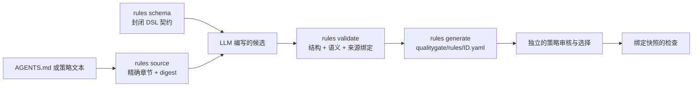

# Schema 驱动的仓库规则

[English](../../en/01-user-guide/06-schema-guided-repository-rules.md) · [本卷目录](README.md) · [规则参考](../02-reference/02-rules.md)

Qualitygate 的项目规则编写建立在两个核心观点上：

1. 可执行规则是受封闭 JSON Schema 管理、带版本的结构化数据，不是非正式 prompt，也不是任意插件代码。
2. `AGENTS.md` 等仓库说明是规范来源。LLM 可以把其中可执行的条款翻译为规则候选，但必须由匹配版本的
   CLI 绑定精确来源、校验 Schema 与语义、发布候选，并在之后针对快照执行。

这种分工让自然语言意图可审核，同时避免把模型解释本身变成门禁判定。



## Schema 结构化了什么

版本匹配的 project-rule Schema 可由 `rules schema` 导出，也随 Agent Skill 发布在
`references/schemas/project-rule.schema.json`。

| 契约字段 | 含义 |
| --- | --- |
| `schema_version`、`id`、`version` | 协议版本与稳定规则身份。 |
| `source` | 仓库相对文档、精确章节及 `rules source` 返回的 digest。 |
| `language`、`applies_to` | 显式语言和路径/provenance scope。 |
| `requires_capabilities` | evaluator 必须具备的事实；缺失时结果为 incomplete。 |
| `when` | commit、file、test、comment 或 import 的封闭 subject/change selector。 |
| `then` | 支持的名称、文本、marker、dependency、count、required-path、line 或 word assertion。 |
| `binding` | 需要追溯时使用的 annotation、comment 或 Git trailer 类型化关联。 |
| `fix` | 从同一来源条款推导的可执行修复说明。 |

未知字段会被拒绝。JSON Schema 校验序列化形状；CLI 还会校验正则、glob、条件字段组合、受限路径、
来源字节、capability 兼容性、重复 ID 与资源预算。任一层校验成功都不等于规则获批，也不能证明 prose
翻译正确。

## 在不编造策略的前提下转换 `AGENTS.md`

首先导出运行时契约，并绑定精确规范章节：

```bash
qualitygate --root . rules schema --format json
qualitygate --root . \
  rules source --document AGENTS.md --section "Quality contract" --format json
```

把返回的 `source` 对象原样复制到候选中。例如，文件行数限制可以采用以下结构；其中缩写 hash 必须
替换为 `rules source` 返回的精确值：

```yaml
schema_version: 1
id: authored-file-line-limit
version: 1
source:
  document: AGENTS.md
  section: Quality contract
  content_hash: "sha256:<rules source 返回的精确 digest>"
language: []
required: true
severity: error
applies_to:
  paths: ["src/**/*.rs", "tests/**/*.rs", "docs/**/*.md", "*.md", ".github/workflows/*"]
requires_capabilities: [files]
when:
  entity: file
  change: all
then:
  max_lines: 1000
fix: 拆分文件，同时保留其 ownership 与测试契约。
```

再根据其余每条约束真正需要的证据分类：

| 仓库约束示例 | 正确表示方式 |
| --- | --- |
| “源码、测试、文档和 workflow 文件不超过 1,000 行。” | project rule：`file`、`change: all`、限定路径、`max_lines: 1000`。 |
| “这些 owner 或测试文件必须存在。” | 完整文件清单 project rule 加 `required_paths`。 |
| “禁止从 A 层 import B 层。” | 源码 import 足以证明时使用解析后的 `import` 规则；否则使用带项目事实的 `module-boundary`。 |
| “依赖必须无环。” | 复用架构 lint 或有界 command check；文本正则无法证明图属性。 |
| “必须运行 fmt、clippy 和全部测试。” | policy command check，不是 project-rule assertion。 |
| “必须由 reviewer 判断设计质量。” | 人工/manual acceptance；不能把判断编造成正则。 |

只有有限 DSL 能表达的条款才成为 project-rule 候选。不支持的条款应保留为 capability gap，或路由到
既有 lint、AST/project adapter、command check 或人工决策。

在获准的临时路径写好候选后，通过匹配版本的 CLI 校验和发布：

```bash
qualitygate --root . rules validate candidate.yaml --format json
qualitygate --root . rules generate --input candidate.yaml --format json
qualitygate --root . rules validate --format json
```

`generate` 原子写入 `qualitygate/rules/<id>.yaml`，但不会启用规则。采用规则是独立策略变更：选择
project-rule 目录、在目标 profile 启用 ID、保留 source review，并重新执行快照检查。新 digest、生成
成功或 LLM 建议都不构成批准。

## Skill over CLI

对于 Agent，Qualitygate Skill 是 CLI 之上的决策与安全层：它指导 LLM 选择正确工作流和证据强度，
判断何时需要变更授权，以及何时约束无法表达。CLI 才是 Schema 导出、精确来源绑定、校验、生成、
策略规划和检查的可执行权威。LLM 不得模拟这些操作、手写未经验证的“等价格式”，也不能把 prose
解释当作门禁通过。

完整 Agent 流程见 Skill 随包的[规则编写指南](../../../skills/qualitygate-cli/references/rule-authoring.md)，
运行时边界见[规则引擎架构](../03-architecture/06-rule-engine-implementation.md)。
