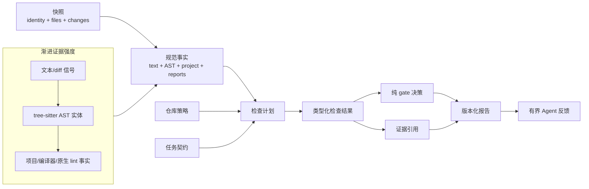

# 逻辑视图

[English](../../en/03-architecture/01-logical-view.md) · [本卷目录](README.md)

逻辑视图描述可复用核心的稳定概念：快照、事实、策略、检查、诊断、证据、任务和 gate 决策。它回答
“系统具备哪些能力、彼此如何关联”，不依赖某个 CLI 进程或部署拓扑。



策略和任务是合并进同一计划的不同输入。适配器发布事实但不决定 gate；domain 在不访问文件系统、
进程或网络的情况下组合类型化结果。更强事实缺失时，不能静默降级为较弱事实。

核心引擎与语言无关。适配器发布带能力和完整性元数据的显式事实；策略规则消费这些事实；application
把规则结果与命令证据、任务验收组合起来。

```text
Git 快照
  -> 语言、项目和报告适配器
  -> 规范事实与能力缺口
  -> 已验证仓库策略及可选任务契约
  -> 依赖感知的执行计划
  -> 有界规则与命令证据
  -> 完整/通过决策、报告及可选反馈
```

语言适配器识别支持文件并提取测试、注解、import、调用和注释等结构；项目适配器解析模块、依赖、
解释器和构建事实；报告适配器归一化现有工具，但不声称源格式未提供的语义。语法树不等于类型解析或
数据流知识。

配置加载严格且绑定快照。计划记录每项检查为何适用、依赖什么、是否必需以及预期完整性证据。任务检查
与仓库检查合并，不能删除后者。application 只在前置条件允许时调度，并显式保留 skipped/pending。

证据具有类型：源码位置、指纹、命令尝试、原报告摘要、工具版本、覆盖率总数、验收记录和 provenance
遵循不同契约。适配器不能把缺失值变成默认事实。纯 domain 只根据类型化输入计算 gate，不读文件系统，
也不调用工具。

反馈只是有界投影，不是第二套决策引擎。复验重新进入相同的获取、计划、执行与决策流程，避免面向 Agent
的摘要与完整报告发生漂移。

规则引擎只是该模型的一个消费者，而不是全部架构。它同时支持低成本 diff/文本信号、tree-sitter
结构规则、项目事实规则、自定义 DSL 与原生 lint/report adapter，并保留各自不同的证据强度。详见
[规则引擎技术深潜](06-rule-engine-implementation.md)。
