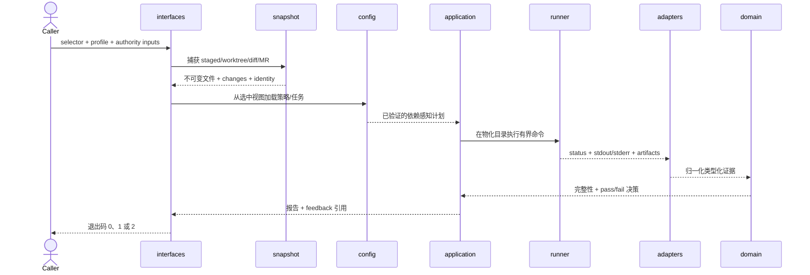

# 进程视图

[English](../../en/03-architecture/02-process-view.md) · [本卷目录](README.md)

进程视图说明一次检查及复验的运行顺序、异步所有权、并发、截止时间、取消和失败传播。

检查从不把可变仓库路径当作执行真相。snapshot 层解析选择器、清点条目、应用字节/文件/时间限制、
计算内容摘要并产生不可变输入。除非调用方显式提供外部权威输入，策略、任务、自定义规则、源码和构建
输入都从选中视图加载。

不可变交接是关键边界。后续阶段接收捕获字节和摘要，而不是重新打开开发者可变源码路径的权限。
外部信任记录作为调用方保护输入重新验证，绝不会静默从被检查仓库中取得。

物化过程为项目命令创建一次性目录。命令获得固定 argv、cwd、环境策略、截止时间、输出限制和预期
工件。runner 以有界缓冲读取 stdout/stderr，终止超时进程树，并保留部分证据。阻塞操作不会占用
异步编排资源。

快照身份以及策略/任务摘要进入每个计划和报告。接受结果前，application 会确认产出证据属于同一
物化快照。源码变化、Git 对象缺失、路径无效或报告身份不匹配都会使受影响检查失效。

获取、解析、规则评估和命令执行各自限制并发。同一契约下的工作共享截止时间和计数器，不能通过拆分
规避总限制。序列化前恢复确定性顺序，避免并行执行产生不稳定报告。

网络活动只属于远端适配路径，不能作为本地证据的隐式回退。凭据由调用方提供且不会复制进报告。
物化检查时 CLI 不修改用户 Git 配置或选中的源仓库。

最终决策区分规则违规与无法完成。失败关闭是架构契约：工具不可用、超时、报告超大、解析错误、冲突、
符号链接逃逸或不支持的文件形态，都不能被转换成成功的空结果。

quick 与 full 使用同一时序；profile 改变计划，不改变证据含义。quick 报告携带所省略检查，复验则
捕获新快照，而不是把旧证据附着到新字节上。
