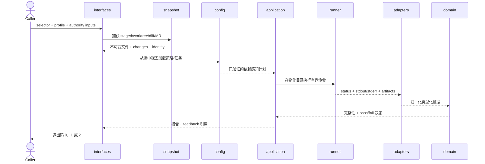

# 进程视图

[English](../../en/03-architecture/02-process-view.md) · [本卷目录](README.md)

进程视图说明一次检查及复验的运行顺序、异步所有权、并发、截止时间、取消和失败传播。

检查从不把可变仓库路径当作执行真相。snapshot 层解析选择器、清点条目、应用字节/文件/时间限制、
计算内容摘要并产生不可变输入。除非调用方显式提供外部权威输入，策略、任务、自定义规则、源码和构建
输入都从选中视图加载。

```mermaid
sequenceDiagram
    actor Caller
    participant CLI as interfaces
    participant Snap as snapshot
    participant Config as config
    participant App as application
    participant Run as runner
    participant Adapt as adapters
    participant Domain as domain

    Caller->>CLI: selector + profile + authority inputs
    CLI->>Snap: 捕获 staged/worktree/diff/MR
    Snap-->>CLI: 不可变文件 + changes + identity
    CLI->>Config: 从选中视图加载策略/任务
    Config-->>App: 已验证的依赖感知计划
    App->>Run: 在物化目录执行有界命令
    Run-->>Adapt: status + stdout/stderr + artifacts
    Adapt-->>Domain: 归一化类型化证据
    Domain-->>App: 完整性 + pass/fail 决策
    App-->>CLI: 报告 + feedback 引用
    CLI-->>Caller: 退出码 0、1 或 2
```

不可变交接是关键边界。后续阶段接收捕获字节和摘要，而不是重新打开开发者可变源码路径的权限。
外部信任记录作为调用方保护输入重新验证，绝不会静默从被检查仓库中取得。

物化过程为项目命令创建一次性目录。命令获得固定 argv、cwd、环境策略、截止时间、输出限制和预期
工件。runner 以有界缓冲读取 stdout/stderr，在超时或取消时终止 Unix 进程组或 Windows Job，
并保留部分证据。Unix 后代进程可通过新建会话或进程组离开原组；这不构成任意进程树沙箱。
Windows Job 行为需要独立的平台原生测试。阻塞操作不会占用异步编排资源。

基线执行在阻塞工作线程中直接从已捕获的 base 派生身份和文件，保留父级范围绑定并清除目标版本的
变更及提交上下文。报告与兼容性检查的每次执行在物化和输入校验之间共享同一不可变执行快照。
兼容性比较直接接收已捕获归档的所有权，无需复制源码树。每次执行仍使用独立工作区并校验输入变化，
以相同字节替换原文件也会被识别。

共享快照的输入校验器直接复用采集时的内容摘要；直接接收文件映射的校验器在阻塞工作线程中计算摘要。
两种构造路径都要先检查物化文件的实际字节、权限与文件状态，之后的验证仍会锁定首次失败，
即使命令恢复原始内容也不能清除失败状态。

在 Windows 上，校验器还会持有允许共享读取、拒绝数据写入与删除/重命名访问的文件句柄，
防止原地改写通过恢复字节和修改时间隐藏。已有不兼容的写入句柄会阻止校验器创建，不能退回无保护执行。
句柄获取与初始校验共享 30 秒工作预算，文件数量上限仍为 100,000；创建失败和校验器释放都会关闭句柄。
内容、文件身份及属性检查仍然有效，已经检测到的属性变化不能通过恢复属性清除。
原生 selfcheck 将被拒绝的输入变更记录为未完成，并保留阻止或检测变更时的底层错误。
报告生产工具因写入被拒绝而退出时，非零退出码和原始 stderr 作为工具错误证据保留，输入完整性仍为已验证。
若工具在生成报告前退出，原因仍为缺少报告；退出码和 stderr 继续保留写入被拒绝的证据。
实际发生的属性变化则会使输入失效并阻止执行。覆盖率、诊断基线和成对测试有效性检查都保留这一区别，
两种路径均不能给出规则判定。

快照身份以及策略/任务摘要进入每个计划和报告。接受结果前，application 会确认产出证据属于同一
物化快照。源码变化、Git 对象缺失、路径无效或报告身份不匹配都会使受影响检查失效。

获取、解析、规则评估和命令执行各自限制并发。同一契约下的工作共享截止时间和计数器，不能通过拆分
规避总限制。序列化前恢复确定性顺序，避免并行执行产生不稳定报告。

声明历史的子进程、树读取及阻塞解码/摘要共享 60 秒截止时间，逐层传入剩余时间并在完成时复核。
快照名称、Git 分批及 blob 循环同样检查共享获取截止时间。阻塞 worker 采用协作取消：读取许可
由 worker 持有直到退出，作用域线程全部 join 后才释放其存储。已经进入的操作系统文件调用
不能由这些 Rust 截止时间检查强制中断。

远端 JSON 响应先执行 1 MiB 上限，再由阻塞 worker 完成解码及原始字节 SHA-256。
最终报告工件序列化与 CLI 文本/JSON/envelope 渲染也在阻塞 worker 中进行。
渲染、反馈持久化及 host 紧凑投影直接转移报告所有权，无需克隆完整报告。
严重性过滤仍仅影响展示的诊断；存储证据和门禁决策保留全部发现。

CLI 调度将选中命令的 future 放在堆上；检查命令使用独立于其他命令的 poll 栈帧，
避免无关命令分支的局部栈存储叠加到当前检查路径。识别到的 Cargo 测试摘要由阻塞 worker
解析；即使解析失败，stdout 和 stderr 仍保留原始共享缓冲区，进程元数据保持不变。保存证据、输入复核、
超时和捕获失败相对于测试计数错误的优先级保持不变。真实 Cargo 回归在隔离子进程的
768 KiB 测试线程上轮询调度器，并验证失败、修复和零测试结果。该额度只描述此 fixture，
不保证所有命令都能在相同栈上执行；生产 Windows 栈设置和门禁要求均不调整。

反馈投影先用借用字段的类型化诊断预览计算序列化大小，仅为能放入类别额度的成员构建拥有数据的
JSON 对象；每项选中检查只查找一次验收关联。剩余额度连该检查的最小成员都无法容纳时，只停止
当前诊断清单，仍考虑标识更短的后续检查和独立预算的执行缺口。较大的成员放不下时，后面的较小
成员仍可入选。总数、省略数、顺序、UTF-8 截断、完整复验参数和原报告的门禁结论保持原语义。
当后面的更小成员仍可能放入时，扫描仍有必要；输出字节上限本身不限制检查的输入诊断数量。

网络活动只属于远端适配路径，不能作为本地证据的隐式回退。凭据由调用方提供且不会复制进报告。
物化检查时 CLI 不修改用户 Git 配置或选中的源仓库。

最终决策区分规则违规与无法完成。失败关闭是架构契约：工具不可用、超时、报告超大、解析错误、冲突、
符号链接逃逸或不支持的文件形态，都不能被转换成成功的空结果。

quick 与 full 使用同一时序；profile 改变计划，不改变证据含义。quick 报告携带所省略检查，复验则
捕获新快照，而不是把旧证据附着到新字节上。

---

[上一章：逻辑视图](01-logical-view.md) · [全书目录](../README.md) · [下一章：开发视图](03-development-view.md)
