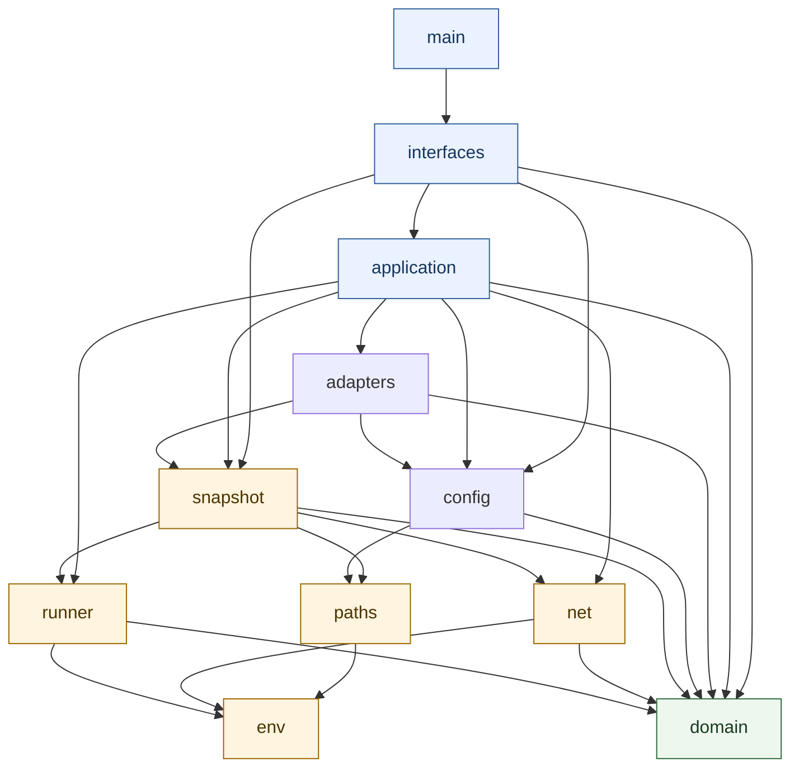

# 开发视图

[English](../../en/03-architecture/03-development-view.md) · [本卷目录](README.md)

开发视图把逻辑职责映射到 Rust 源码 owner、允许 import、测试面和构建期约束。它回答“修改应放在哪里、
允许依赖什么”。

Rust crate 使用显式顶层 owner 和无环依赖图。crate root 只声明 owner；可执行入口仅委托给接口层。

箭头表示“允许依赖”。所有 owner 都可使用纯 domain 契约，但只有命名的边界 owner 才能访问相应外部
能力。依赖图有意保持非对称：adapter 可消费 snapshot 事实，snapshot 不能反向导入 adapter；
interfaces 调用 application 用例，application 不解析 CLI 参数。

| Owner | 职责 |
| --- | --- |
| `domain` | 可序列化契约与纯 gate 决策；禁止进程、文件系统、网络和环境 I/O。 |
| `env` | 环境变量读取及其派生值。 |
| `paths` | 受限路径验证与安全解析。 |
| `net` | 有界网络访问和远端获取契约。 |
| `runner` | 有界异步进程执行与证据捕获。 |
| `snapshot` | Git 选择器、不可变文件获取、变更映射与物化。 |
| `config` | 严格的策略/任务加载、验证与计划。 |
| `adapters` | 语言/项目事实与外部报告归一化。 |
| `application` | 检查编排、反馈、复验和用例协调。 |
| `interfaces` | CLI 参数解析与输出渲染。 |
| `main` | 只委托给 `interfaces` 的进程入口。 |

共享契约应放在 `domain`，而不是 CLI 或具体适配器中。接口层不直接执行外部 I/O。阻塞的文件系统与
解析工作和异步编排隔离；网络、环境和路径访问各有专门 owner，便于能力审核。

架构测试解析全部生产 Rust 源码，解析模块与 import 路径（含分组、别名、宏和条件引用），检查 owner
边、禁止能力和环，并输出可审核的源码摘要/行号报告及 DOT 图。隐藏根导出、歧义模块文件、未知 owner、
宽泛外部 glob 和纯 domain 中的 I/O 都会被拒绝。

文档、示例、测试与构建元数据可调用公共接口，但不会形成新的生产 owner。修改模块所有权或 import 后，
除编译外还必须运行架构门禁并审核其边证据。

这种划分让审核者分别回答三个问题：决策是否纯且可序列化，外部动作是否受限有界，以及编排是否在不
产生依赖环的前提下组合能力；同时也让可复用 library 不依赖可执行接口。
