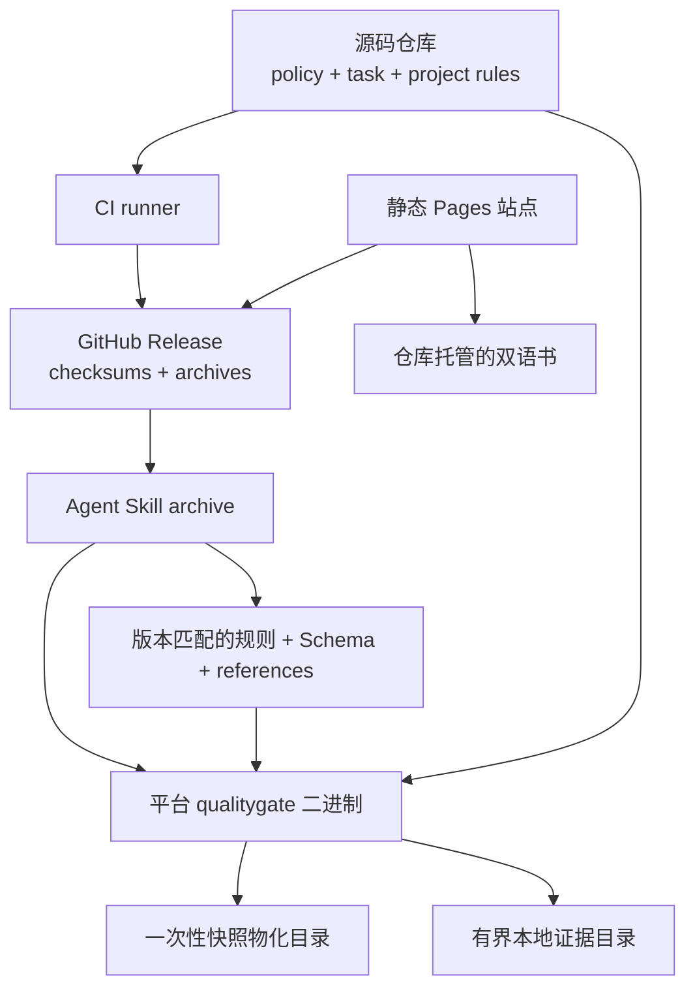

# 物理视图

[English](../../en/03-architecture/04-physical-view.md) · [本卷目录](README.md)

物理视图展示版本化二进制、规则资产、Agent Skill、仓库策略、CI runner、发布归档和静态站点如何部署
与连接。

可执行文件与规则资产构成一个兼容性单元。仓库策略仍由仓库拥有；trust store 与签名证据位于被检查树
之外；临时物化目录和证据目录都不是部署源。

可发布 Agent Skill 是发布版 CLI 的版本化包装，而不是另一套实现。归档包含 `SKILL.md`、provider
元数据、参考资料、Schema、规则资产、fixtures、试点模板和平台二进制；Skill 与 CLI 版本必须一致。

运行时 Skill 只选择当前操作系统与架构的二进制，验证 `--version`，并把 CLI 指向内置规则资产目录。
资产不可用或不兼容时可回退到已验证的公开安装，但不能静默构建/信任当前仓库源码，不能跨越
Windows/POSIX shell 边界，也不能忽略缺失资产。

Skill 指令保留 CLI 的权威边界：可发现规则、运行检查和投影修复反馈，但不能发明受信策略、任务验收、
证据目录、签名、人工批准或 reviewer 决定。声明代码任务完成前，需要最终快照的无路径过滤 full
检查，以及仓库另外要求的门禁。

发布自动化在发布前验证 Rust 质量门禁、包内容、导出 Schema、内置规则字节、试点资产、版本一致性和
归档校验和。平台构建/发布工件与源码树测试属于不同证据。tag 可触发发布；手动 dry run 不会静默发布。

静态 Pages 站点从 `main` 的 `site/` 部署。它链接仓库中的中英文书籍，不复制书籍内容到站点工件。
站点测试检查当前版本下载 URL 与仓库文档目标；真实 Pages 部署仍属于外部证据。
