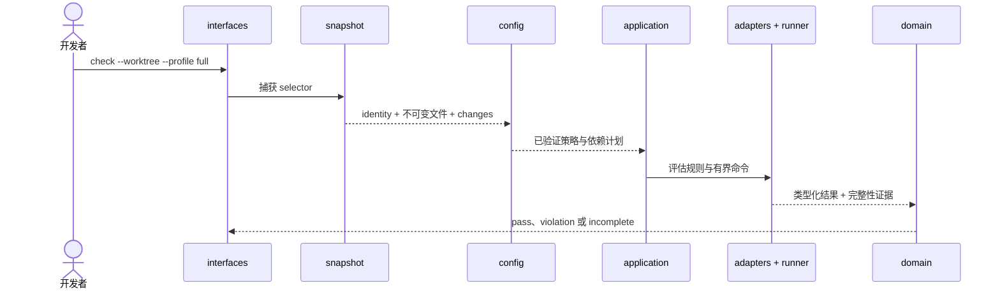
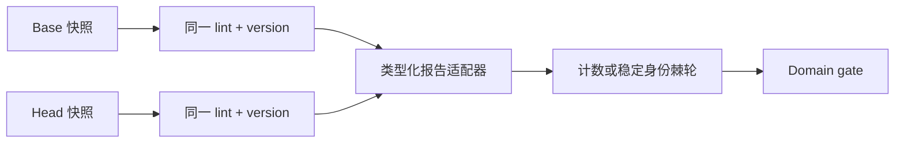
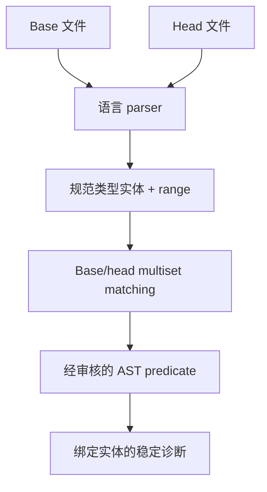
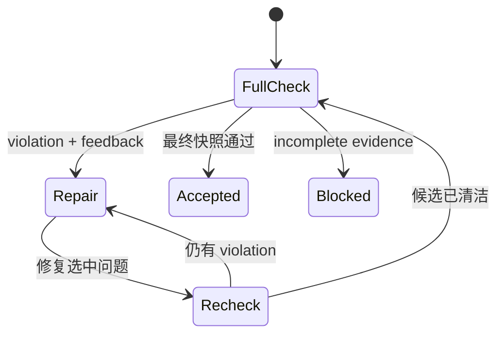

# +1 场景视图

[English](../../en/03-architecture/05-scenarios.md) · [本卷目录](README.md)

+1 视图用可观察工作流验证另外四个视图。每个场景都标明逻辑契约、运行路径、源码 owner、物理部署和
fail-closed 结果。这些是架构场景，不是另一套 CLI 使用说明。

## 场景一：绑定快照的首次检查

- 逻辑视图：snapshot、policy、plan、类型化结果、evidence 和 gate decision。
- 进程视图：先捕获再规划；所有 producer 共享 snapshot identity 与资源边界。
- 开发视图：`interfaces` 委托，`application` 编排，adapter 归一化，只有 `domain` 做决策。
- 物理视图：发布二进制读取仓库策略，在一次性 materialization 旁写入有界证据。
- 失败语义：文件缺失、策略错误、超时和畸形报告返回 incomplete；完成的命中返回 violation。

## 场景二：复用原生 lint 并建立棘轮

- 逻辑视图：原生 finding 保持原生事实，ratchet 是策略断言，不改名 lint 语义。
- 进程视图：base/head 使用相同 producer 配置，并受 deadline、输出上限与完成标志约束。
- 开发视图：`runner` 拥有进程，报告 adapter 校验并归一化，config 规划依赖，domain 比较证据。
- 物理视图：项目提供既有 lint 及配置，CLI 提供编排与报告契约。
- 失败语义：工具缺失、版本变化、报告不完整或快照未绑定都为 incomplete，不会生成零 finding 基线。

## 场景三：用 tree-sitter AST 增强规则

- 逻辑视图：parser capability 与规范实体替代有歧义的文本信号，公开 rule/report 契约保持稳定。
- 进程视图：在应用 filter 与 predicate 前，对完整 base/head 变更执行解析，并共享 deadline 与实体上限。
- 开发视图：语言 adapter 拥有 tree-sitter query；共享实体与诊断契约留在可复用 core。
- 物理视图：grammar crate 是链接进发布二进制的第三方 native dependency，不依赖 parser service。
- 失败语义：不支持的语言、解析失败、歧义复制或预算耗尽都显式呈现；AST 精度不会包装成类型或数据流分析。

## 场景四：有界 Agent 修复闭环

- 逻辑视图：feedback 是同一 report 和稳定 fingerprint 的投影，不是另一套 authority。
- 进程视图：每次 recheck 都捕获当前字节；迭代与输出有界，最终验收重跑未过滤的 full plan。
- 开发视图：`application` 拥有 feedback/recheck 编排，`interfaces` 只负责渲染。
- 物理视图：Agent Skill 调用版本匹配的发布二进制与 bundled asset；信任输入保持外置。
- 失败语义：fingerprint 过期、快照漂移、迭代耗尽或证据不完整都会停止验收。

## 场景五：发布并消费 Skill

发布自动化运行质量门禁，验证 Schema 和 bundled rule bytes，构建各平台 archive，检查 package/CLI
版本一致性并发布 checksum。使用方选择匹配平台的 binary、验证版本、提供仓库自有 policy，再运行
场景一的同一流程。因此物理 package 无法绕过逻辑证据模型、进程边界或开发所有权图。

这些场景由各 owner 边界上的单元及集成门禁覆盖。任何改变场景的变更，都必须同步更新
[CodeSpec](../../../codespec/requirements/qualitygate-cli.md) 中的需求与测试证据。
