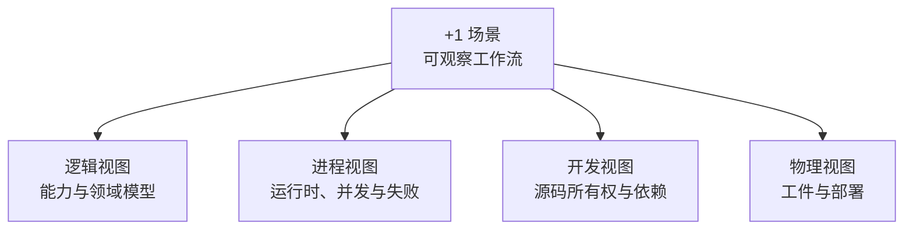

# 第三卷：架构——4+1 视图

[English](../../en/03-architecture/README.md) · [书架](../README.md)

主架构按 Kruchten 4+1 模型组织。每个视图回答一种审核问题，场景视图再用可执行流程把它们串联。

1. [逻辑视图](01-logical-view.md)
2. [进程视图](02-process-view.md)
3. [开发视图](03-development-view.md)
4. [物理视图](04-physical-view.md)
5. [+1 场景](05-scenarios.md)

技术深潜：[规则引擎实现](06-rule-engine-implementation.md)。
